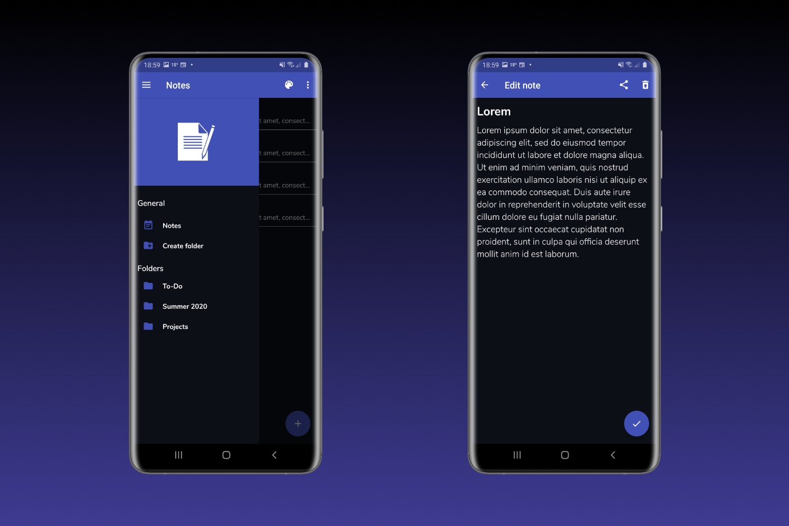
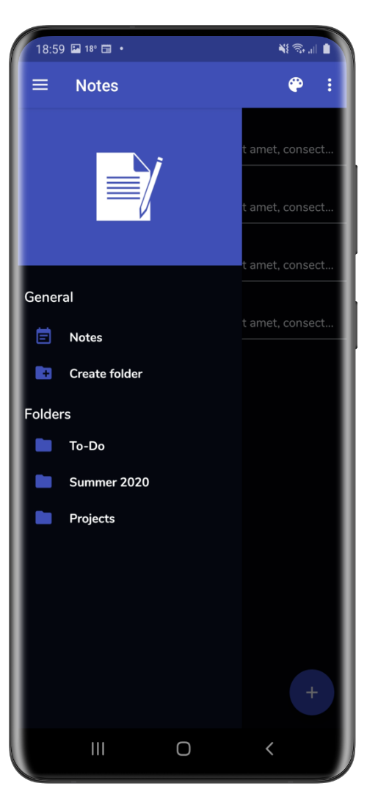
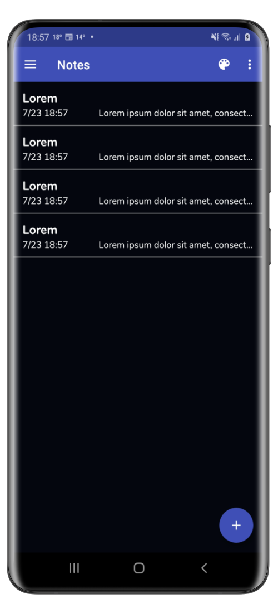
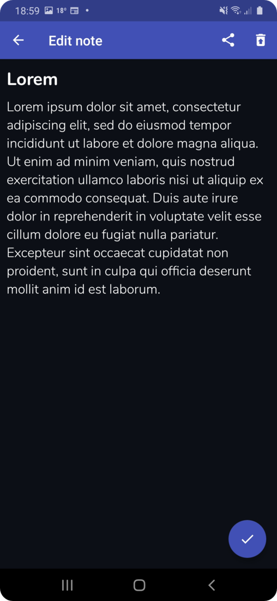
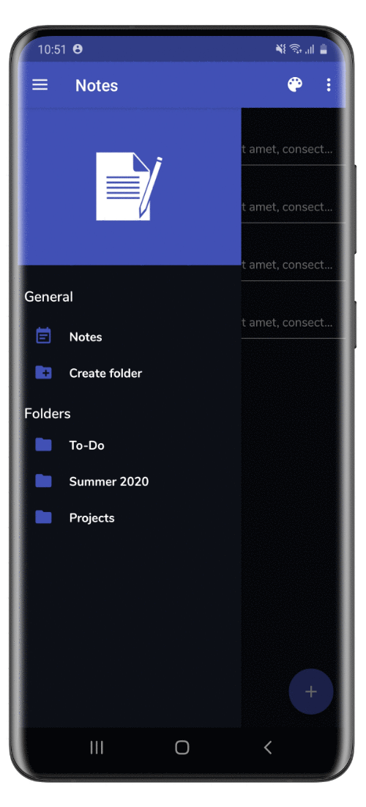

# Notes App Android
 

## Introduction
This is a demo application built with the goal to learn about the MVVM Architectural Pattern and to create a fun application.

See below for more information about what components were used.

## Technologies & Architecture 

#### Technologies
Android, Kotlin

#### Architecture
Model-View-ViewModel (MVVM)

#### Architecture Components
[ViewModel](https://developer.android.com/topic/libraries/architecture/viewmodel), [LiveData](https://developer.android.com/topic/libraries/architecture/livedata), [Room](https://developer.android.com/topic/libraries/architecture/room), [DataBinding](https://developer.android.com/topic/libraries/data-binding), 
[Navigation](https://developer.android.com/guide/navigation/)

## Features
- Notes: Add, edit, remove, undo delete all
- Folders: Add, edit, remove
- Share notes: To and from other apps
- Themes: Change between 3 different themes

## Screenshots
<table>
<thead>
<tr>
<th align="center">Main</th>
<th align="center">Notes</th>
<th align="center">Edit</th>
<th align="center">Themes</th>
</tr>
</thead>
<tbody>
<tr>
<td> </td>
<td> </td>
<td> </td>
<td> </td>
</tr>
</tbody>
</table>

## Setup
#### Requirements
* Basic knowledge about Android Studio

#### Project
1. Download and open the project in Android Studio
2. Connect your Android phone or use the emulator to start the application

